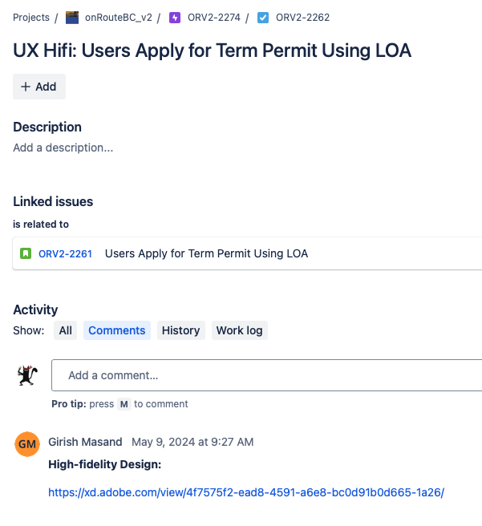

# onRouteBC_Specs
// Specifications for stories written in Gherkin format

## Additional Resources:

Data Discovery: 

The data discovery is a tool used by the discovery team to document new data elements required to facilitate the development of a new feature in onRouteBC. It includes useful information such as the UI name, data element description, physical and logical specs (if required). 

https://bcgov.sharepoint.com/:x:/r/teams/04314/_layouts/15/Doc.aspx?sourcedoc=%7B202964AC-EDC7-46D9-B021-14C9954109CB%7D&file=Data%20Discovery.xlsx&action=default&mobileredirect=true

Roles and Permissions Matrix: 

The roles and permissions matrix is a tool used to describe the user groups and their unique feature permissions in onRouteBC.

https://moti-imb.atlassian.net/wiki/spaces/ORV2/pages/102498349/Roles+Services+and+Permissions+Matrix

UX/UI Designs are linked to the UX: ticket for the story:

If Required Diagrams and Flows are in Confluence under Story Discovery Boards: https://moti-imb.atlassian.net/wiki/spaces/ORV2/folder/281247997?atlOrigin=eyJpIjoiMmRiOTM2NTk1NWQxNDAyYjg4N2UyZWUzMjFiM2JkNDQiLCJwIjoiYyJ9
