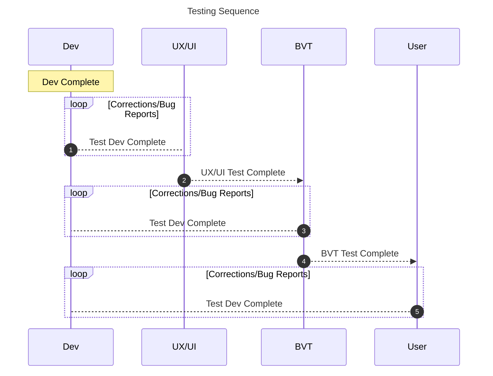

## Next Actions/Notes
- Research mobile testing emulators
- Are there desktop emulators we could use and do they support versions?
- Ask Peter re OSX versioning - A. OSX devices are unmanaged
- Discuss with Dev team re the possibility of story completion to BVT within a sprint
- Bryan Lane will engage IMB for testing practice in the new process
	- cadence, when do you test?, continuous testing?

## Intro

## QA Environments
Test: https://onroutebc-test-frontend.apps.silver.devops.gov.bc.ca/

UAT: https://onroutebc-uat-frontend.apps.silver.devops.gov.bc.ca/

### Automation Tools
- 
### Operating Systems
#### Desktop
- Windows 10 Enterprise
- OSX Monterey, Ventura
#### Mobile
- Android
- IOS
- IpadOS
### Web Browsers (latest version, including security updates)
- Chrome
- Safari
- Edge
- Firefox

## Process

### Sizes
#### Small (Unit)
Testing smallest pieces of code software
- Code blocks
- Single scenarios in a feature

#### Medium (Component)
Testing multiple portions of software 
- Multiple code blocks or entire microservice
- All scenarios in a feature 

#### Large (End_to_end)
Verify the whole system meets business goals
- Testing 
- Multiple components tested within the application
- Persona journeys testing multple features to complete an entire workflow (e.g. buying a permit)

### Types

#### UX/UI Testing
Assessing developed front end UX/UI against HiFi Design (Prototype)
Verify:
- Meets Government UI standards
- Textual Content: Confirm static informational text, 
- Functionality: Functional aspects of the UI, such as ensuring that buttons, links, forms, and other interactive elements work as intended, drop downs, cursor hover.
- Usability: Clarity, consistency, intuitiveness, and efficiency of user interactions.
- Responsiveness: How the UI responds to different screen sizes and resolutions. Test the UI's adaptability and ensure that it remains usable across various platforms and browsers.
- Accessibility: Testing with keyboard navigation, colour contrast, text resizing, and other accessibility standards, tab stops.
- Performance: UI performance testing to evaluate the responsiveness and speed of the UI
- Visual Design: Visual aesthetics, including layout, colour scheme, typography, and graphics. Verify that the UI adheres to the brand guidelines and provides a visually pleasing experience.
- Error Handling: How the UI handles and communicates errors to users. Will include scenarios such as validation errors and user input errors.
- Compatibility: UI should work seamlessly across different operating systems, browsers, and devices.

#### Functional
Comparing software functions and features with desired system behaviour state changes Gherkin scenarios (onRouteBC Specification)
Verify:
- Positive and negative scenarios
- Cross-browser and operating system

##### BVT
Using onRouteBC Specifications as test cases and includes the review of underlying transactions (e.g., database writes) as well as the assessment of the correct application of business process, policy and regulation.
- Completed by technical and SME staff
- Bugs are tracked in JIRA and processed during backlog refinement activities
- Black box and white box

##### UAT
Can use onRouteBC Specifications as test cases or not. End users test a release candidate or production to ensure it meets usability needs.
- Completed by end users (e.g. CV Clients, PPC Staff) 
- Triaged with product team (UX Design, PO, BA)
- Usability testing (User research)
- Operational acceptance (can you complete a business process task)
- Feedback tracked in JIRA as story stubs and processed during backlog refinement activities
- Black box
- Beta testing?

##### Integration (Medium)
Verify communication and interaction between components to find interface defects

##### Smoke
- Post release high-level functional

#### Non-Functional
##### Performance
- System time out
- Use under load
- System recovery

##### Code Review
Using onRouteBC Specifications as test cases and comparing against dev complete feature prior to merging to the test branch.
- Completed by Dev
- Black box and white box

##### Security
- Log on and off
- Authorization
- 
##### Vulnerability
- Attack simulation

## People and Schedule

| Test Type | People                | When and What                            | Data | Manual or Automated? |
| --------- | --------------------- | ---------------------------------------- | ---- | -------------------- |
| UX/UI     | UX Designers and Devs | Testing Dev complete from prior Sprint   |      | Manual               |
| BVT       | IMB and SMES          | Testing Dev complete from prior Sprint   |      | Manual               |
| User      | Users and SMES        | Testing BVT complete from current Sprint |      | Manual               |
| DEV       |                       |                                          |      |                      |

## Corrections
- Bug reports assume fixing at a later date
- JIRA Bug issue creation

## UX/UI 
  - Issues contrary to gov design policy get individual tickets
  - Functional issues triage with BA
  - Design issues that are considered of particular importance will get individual tickets e.g., BC Logo being in the wrong position

## Future Updates
- aligning version control and traceability
- 
